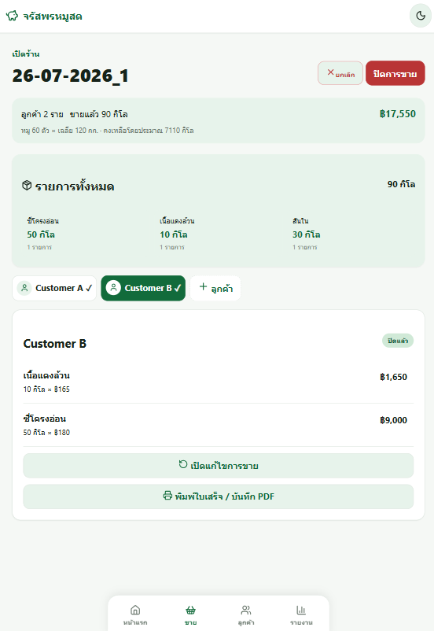
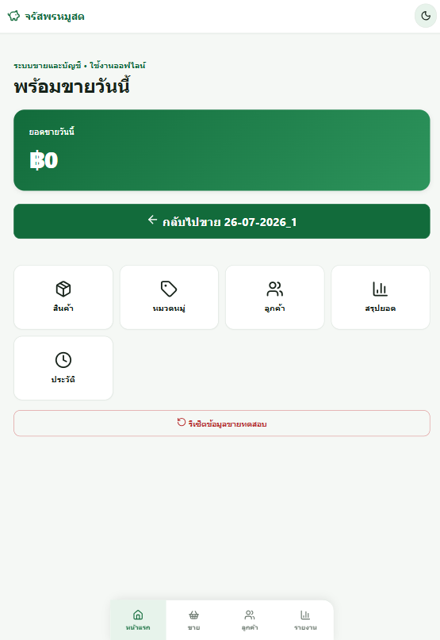
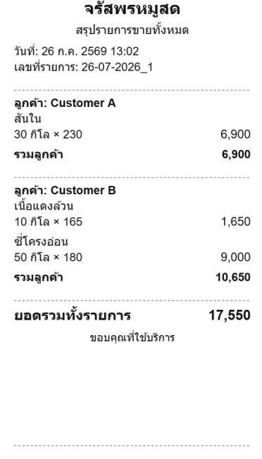

# Jarasporn Fresh Pork (จรัสพรหมูสด)

> [!NOTE]
> **Proof of Concept (POC)**: This project is a Proof of Concept (POC) application developed for testing and evaluating offline-first sales and accounting management for wholesale pork operations.

An offline-first sales and accounting management application designed for wholesale fresh pork shops. Data is stored locally using SQLite, with support for exporting Excel reports and packaging into an Android APK.

---

## Example Interface

### 1. POS & Sales Order Management
Touch-friendly sales interface optimized for butcher shop workflows: rapid cut selection, live scale weight calculations, custom customer pricing, and order settling.



### 2. Operations Dashboard & KPI Monitoring
Centralized operational dashboard showing daily stock tracking (pigs & total weight), live customer queue, sales metrics, and outstanding balances.



### 3. Invoice



---

## Tech Stack

- **Frontend**: Vue 3 + Vite + TypeScript
- **State Management & Routing**: Pinia & Vue Router
- **Mobile Runtime**: Capacitor for Android
- **Database**: `@capacitor-community/sqlite` (local on-device SQLite database)
- **Reporting**: XLSX for Excel report export

---

## Prerequisites

Ensure the following prerequisites are installed:

1. [Node.js](https://nodejs.org/) (LTS version recommended)
2. [Android Studio](https://developer.android.com/studio)
3. Android SDK Platform and Android SDK Build-Tools (installed via Android Studio)
4. JDK (configured with or bundled in Android Studio)

In Android Studio, navigate to **More Actions → SDK Manager** and verify that the following are installed:
- At least one Android SDK Platform version
- Android SDK Build-Tools
- Android SDK Command-line Tools

---

## Getting Started

1. Open a terminal in the project root directory and install dependencies:

```powershell
npm install
```

2. Start the local web development server:

```powershell
npm run dev
```

---

## Running on Android Studio

Whenever web assets/code are updated, build and synchronize changes to the Android project first:

```powershell
npm run cap:sync
```

Then open the Android project:

```powershell
npm run android
```

*Alternatively, open Android Studio, select **Open**, and browse to the `android/` directory.*

Wait for Gradle Sync to finish. Select an Android Emulator or a connected physical Android device (with USB Debugging enabled) from the toolbar, then click the ▶ **Run** button to launch and test the app.

---

## Building APK

### Via Android Studio

1. Open the `android` folder in Android Studio.
2. Select **Build → Build Bundle(s) / APK(s) → Build APK(s)** from the top menu.
3. Once the build completes, click **locate** in the notification popup.

The debug APK will be generated at:
```text
android/app/build/outputs/apk/debug/app-debug.apk
```

### Via Terminal

1. Build and sync web assets:
```powershell
npm run cap:sync
```

2. Build the debug APK using Gradle wrapper:
```powershell
cd android
.\gradlew.bat assembleDebug
```

The output APK will be located at:
```text
android/app/build/outputs/apk/debug/app-debug.apk
```

---

## Generating Release APK for Distribution

1. In Android Studio, go to **Build → Generate Signed Bundle / APK**.
2. Select **APK**.
3. Create a new Keystore or select an existing one (store credentials safely).
4. Select the `release` build variant.
5. Finish the build to generate the signed APK ready for installation/distribution.

> [!WARNING]
> Never commit Keystore files or passwords to the Git repository.

---

## Troubleshooting & FAQ

### `SDK location not found`

The Android SDK location is not configured in the project. To resolve:

1. In Android Studio, go to **File → Settings → Languages & Frameworks → Android SDK**.
2. Copy the Android SDK Location path.
3. Create an `android/local.properties` file and add:

```properties
sdk.dir=C:\\Users\\<YourUsername>\\AppData\\Local\\Android\\Sdk
```
*(Use escaped backslashes `\\` on Windows or the actual path on your machine).*

### Web code changes are not reflected in the Android app

Run the sync command every time changes are made to the web source code:

```powershell
npm run cap:sync
```

---

## Common Commands Reference

| Command | Description |
| --- | --- |
| `npm run dev` | Starts local web development server |
| `npm run build` | Runs TypeScript checks and builds production web assets |
| `npm run cap:sync` | Builds web assets and copies them to the Android project |
| `npm run android` | Syncs assets and opens the project in Android Studio |

### Quick Start Cheatsheet

```bash
# Install & Run Dev Server
npm install
npm run dev

# Sync & Open Android
npm run cap:sync
npx cap open android
```